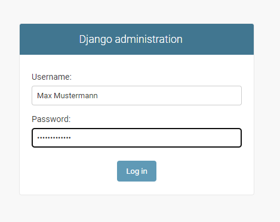

# Django-E-Portfolio


This repository will contain everything associated with my E-Portfolio about Django.  
Feel free to visit the official Django documentation to get some more insights: https://www.djangoproject.com/. You can
also view the presentation slides for a rough overview.

## Requirements

To run the project you need to install the Python interpreter from https://www.python.org/. Afterwards you can install
Django by running  
`python -m pip install django` or `py -m pip install django` if you are on Windows.

## Important commands

- `django-admin startproject <project-name>`  
  Starts a Django project and therefore creates a basic folder structure with necessary files. The folder structure
  should look something like this:
  ```
  \---<project-name>
    |   manage.py
    |   
    \---<project-name>
            asgi.py
            settings.py
            urls.py
            wsgi.py
            __init__.py      
  ```
- `python manage.py runserver`  
  Starts the development server on 127.0.0.1:8000. You can change this behavior by passing a different port as command
  line parameter: `python manage.py runserver <port-number>`.
- `python manage.py startapp <app-name>`  
  Creates a Django app with basic folder structure and necessary files. The app can be added to the project inside the *
  settings.py* file. The structure of an app looks something like this:
   ```
  \---<app-name>
    |   admin.py
    |   apps.py
    |   models.py
    |   tests.py
    |   views.py
    |   __init__.py
    |   
    \---migrations
            __init__.py
   ```
- `python manage.py makemigrations`  
  Creates a file inside the migrations folder of your app that contains the necessary changes for the database. Should
  be executed every time a new model was created or an existing model was modified.
  After modifying the models a bit and running this command three times the migrations folder could look
  something like this:
  ```
  \---migrations
    |   0001_initial.py
    |   0002_alter_todoitem_description.py
    |   0003_todoitem_done.py
    |   __init__.py
  ```
- `python manage.py sqlmigrate <app-name> <migration>`  
  Prints the changes/migrations to be made for the app named `<app-name>` and migration with the id `<migrate>`. An
  example output could look like this:
   ```
  python manage.py sqlmigrate 0003
  
  BEGIN;
  --
  -- Add field done to todoitem
  --
  CREATE TABLE "new__todo_app_todoitem" ("id" integer NOT NULL PRIMARY KEY AUTOINCREMENT, "done" bool NOT NULL, "title" varchar(50) NOT NULL, "description" text NOT NULL, "due_date" datetime NOT NULL);
  INSERT INTO "new__todo_app_todoitem" ("id", "title", "description", "due_date", "done") SELECT "id", "title", "description", "due_date", 0 FROM "todo_app_todoitem";
  DROP TABLE "todo_app_todoitem";
  ALTER TABLE "new__todo_app_todoitem" RENAME TO "todo_app_todoitem";
  COMMIT;
   ```
- `python manage.py migrate`  
  Applies all the changes/migrations to the database.
- `python manage.py createsuperuser`  
  Prompts you to enter username, password and e-mail. Afterwards you are able to login to the administrator site of
  Django using these credentials (by visiting 127.0.0.1:8000/admin):  
  

## Step-by-step guide for creating a task-tracker app